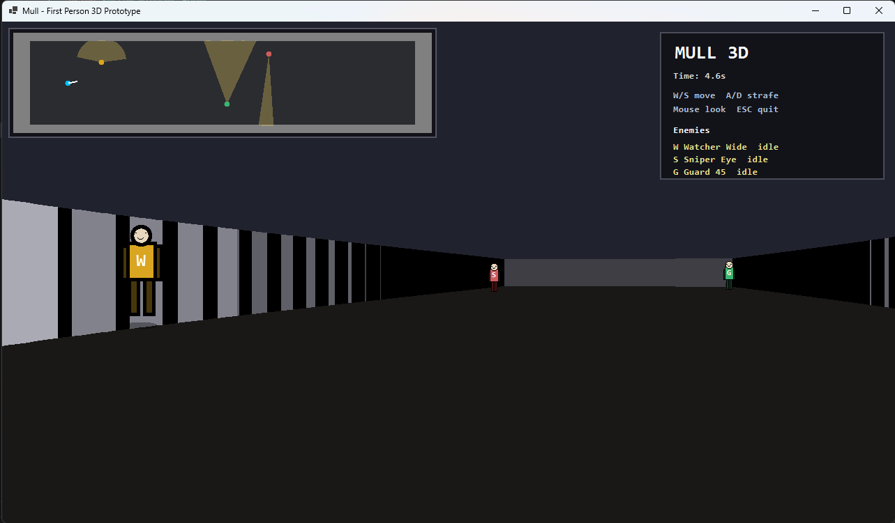

# 🎮 Stealth-MKIII

A first-person stealth prototype built in C# using Windows Forms and a custom raycasting engine.

---

## 🚀 Overview

Stealth-MKIII is a lightweight 3D stealth game where the player must avoid detection from multiple enemy types with unique vision systems.

The game uses a custom-built pseudo-3D renderer (raycasting) to simulate a first-person environment.

---

## 🧠 Core Features

- 🎯 First-person 3D rendering (raycasting engine)
- 👁️ Enemy AI with realistic line-of-sight detection
- 🔺 Multiple enemy vision types:
  - Wide vision (short range)
  - Sniper vision (long range, narrow)
  - Balanced guard vision (45° cone)
- 🗺️ Mini-map with real-time vision cones
- 🧍 Enemy body rendering (low-poly style)
- 🎮 Smooth keyboard + mouse controls

---

## 🎮 Controls

| Action        | Key |
|--------------|-----|
| Move Forward | W   |
| Move Back    | S   |
| Strafe       | A / D |
| Look         | Mouse |
| Turn         | ← → |
| Quit         | ESC |

---

## 🛠️ Tech Stack

- Language: **C#**
- Framework: **.NET (Windows Forms)**
- Graphics: **Custom Raycasting Engine**
- Architecture: **Multi-file modular structure**

---

## 🧩 How It Works

The game uses a raycasting algorithm to simulate 3D:

- Each vertical screen column casts a ray into the map
- Distance to walls determines height and shading
- Enemies are rendered as depth-aware sprites
- Line-of-sight is calculated using angle + obstruction checks

---

## ⚙️ Setup & Run

```bash
git clone https://github.com/dorien1p/Stealth-Game-.git
cd Stealth-MKIII
dotnet run

<p align="center">
  
</p>

